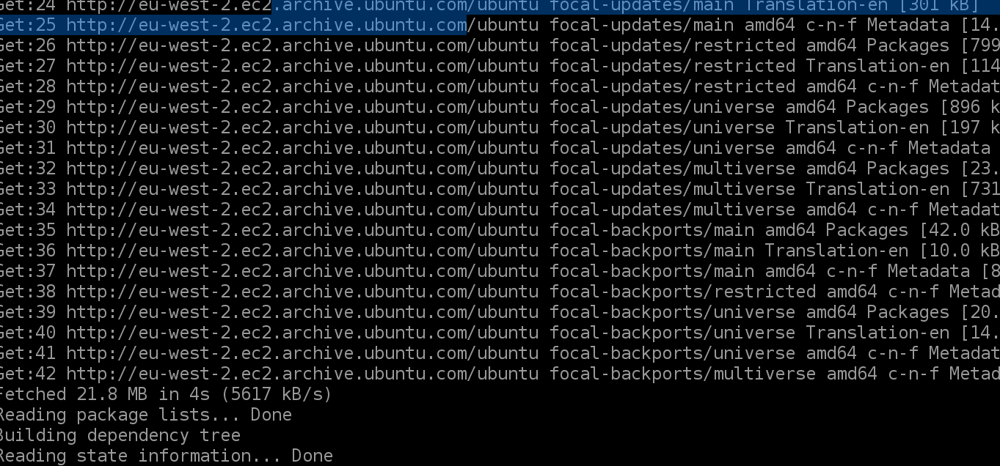
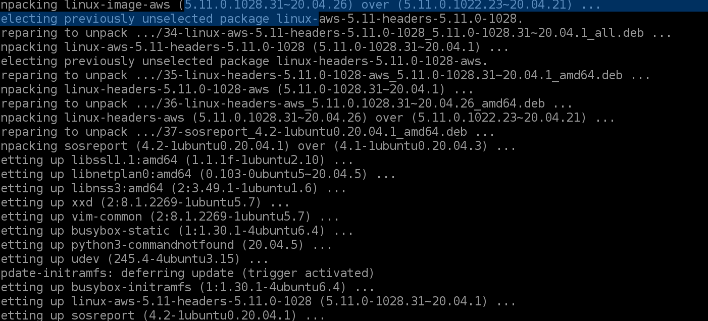
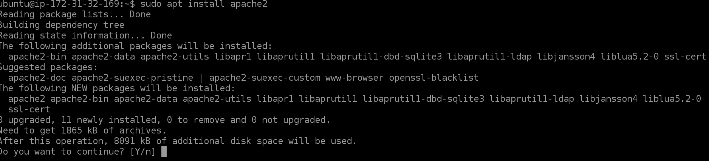
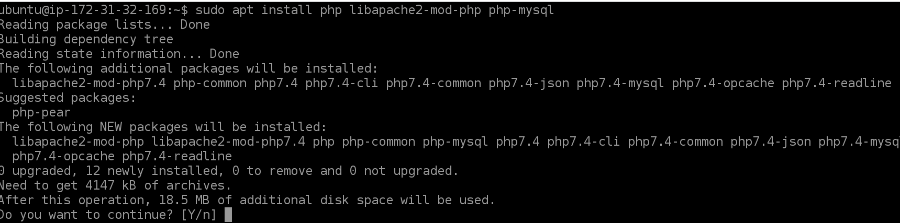
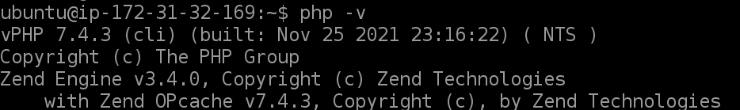
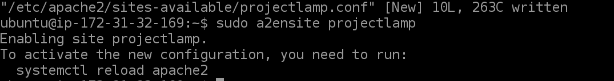

## Project 1: Installing LAMP Stack on Ubuntu Linux using AWS EC2 instance
Step 1a: Updating and Upgrading Ubuntu
      
      Use the following command:
      `sudo apt update'

      'sudo apt upgrade'

Step 1b: Installing Apache2 
 
       Use the following command:
       'sudo apt install apache2`
 

Installing and Securing Mysql 

    Use the following command to install mysql 
       'sudo apt install mysql`
       

    Use the following command to secure mysql:
       'sudo mysql_secure_installation`
 

      
    Your MySQL server is now installed and secured. 

    Next, we need to install PHP, the final component in the LAMP stack.

    Step 3: Installing php

    We need to install the following 3 packages
	1.Sudo apt install php 
	2.libapache2-mod-php 
	3.php-mysql 
 
    Use the following command to install the 3 packages at once:
    'sudo apt install php libapache2-mod-php php-mysql`

    
    Confirm php installation by using the following command: 
    php -v

Step 4: Creating a Virtual host for our website with Apache
    Use the following command to :
    
    1.Enable the new virtual host:
	sudo a2ensite projectlamp
    
    2.Disable Apache’s default website:
	sudo a2dissite 000-default
    
    3.Reload Apache so changes take effect:
    sudo systemctl reload apache2
    

Step 5: Enabling php on your website 
        
    Use the following command:
    sudo vim /etc/apache2/mods-enabled/dir.conf
    
 
      
      

